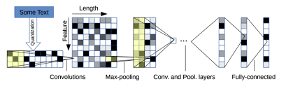

# CharCNN 
<p align="center">
    
</p>

Our project is using the TensorFlow framework to implement the [CharCNN model](https://arxiv.org/abs/1509.01626) to classify English sentences. 

### Model Architecture
<p align="center">
    
</p>

This model utilizes a convolutional neural network to extract features of sentences.
### Team
- Team leader:
    1. Github: <a href = "https://github.com/hoangcaobao" >hoangcaobao</a>
- Team members:
    1. Github: <a href = "https://github.com/Nguyendat-bit" >Nguyendat-bit</a>
    2. Github: <a href = "https://github.com/aestheteeism" >aestheteeism</a>
- Advisor:
    1. Github: <a href = "https://github.com/bangoc123" >bangoc123</a>

## I.  Set up environment
- Step 1: Clone repo to local

```bash
git clone https://github.com/protonx-tf-03-projects/CharCNN.git
```

- Step 2: Change directory to the folder
```bash
cd CharCNN
```

- Step 3: Make sure you have installed Miniconda. If not yet, see the setup document [here](https://conda.io/en/latest/user-guide/install/index.html#regular-installation).

- Step 4: Create an environment
```bash
conda env create -f environment.yml
``` 

- Step 5: Activate environment
```bash
conda activate CharCNN
```

Congratulation. Now you have the environment to use our project.

## II.  Set up your dataset

- We use data IMBD Dataset of 50K Movie Reviews for training that can be easily found at [here](https://www.kaggle.com/lakshmi25npathi/imdb-dataset-of-50k-movie-reviews)
- After that, download it locally then move this CSV file to the CharCNN folder without changing the name
- Dataset (CSV file) has to follow this structure

| review  |   sentiment     |
|:---------:|:-------------:|
| sentence |  label |
| ...           |.... |
- References: [NLP](https://github.com/bangoc123/transformer) and [CV](https://github.com/bangoc123/mlp-mixer)

## III. Training Process
Review training on colab:

<a href="https://colab.research.google.com/drive/1hmEYBX6IP_poOZHUS8lhFJWMKCJeeHTI?usp=sharing&fbclid=IwAR2iWKzGElJMeEMFGfDuHExufT7NqT0SFQVpbVs4qc6Pn9WIdxSP1YUexWM"> </a>

Training script:

```python

python train.py --train-file ${link_to_train_data} --epochs ${epochs} 

```
For example: 
```python

python train.py --train-file data.csv --epochs 3 

```

Due to a large number of datasets, we recommend using epochs smaller than 3


## IV. Predict Process

You create a file CSV with 1 column named sentences to contain your dataset 

Predict script: 
```bash
python predict.py --test-file ${link_to_test_data} --result-file ${name_of_file_contain_result}
```
For example:
```bash
python predict.py --test-file test.csv --result-file result.csv
```
Now you have the sentiment of your sentences in test.csv in result.csv file

## V. Result and Comparision

Small CharCNN performance:
```
Epoch 1/3
313/313 [==============================] - 1583s 5s/step - loss: 0.6929 - accuracy: 0.5117 - val_loss: 0.6782 - val_accuracy: 0.5392
Epoch 2/3
313/313 [==============================] - 1554s 5s/step - loss: 0.3542 - accuracy: 0.8433 - val_loss: 0.2596 - val_accuracy: 0.8948
Epoch 3/3
313/313 [==============================] - 1481s 5s/step - loss: 0.1619 - accuracy: 0.9414 - val_loss: 0.2819 - val_accuracy: 0.8902
```

Bidirectional LSTM + Dense performance:
```
Epoch 1/3
313/313 [==============================] - 5085s 16s/step - loss: 0.4762 - acc: 0.7655 - val_loss: 0.4360 - val_acc: 0.8097
Epoch 2/3
313/313 [==============================] - 4386s 14s/step - loss: 0.2837 - acc: 0.8928 - val_loss: 0.2808 - val_acc: 0.8905
Epoch 3/3
313/313 [==============================] - 2185s 7s/step - loss: 0.1841 - acc: 0.9351 - val_loss: 0.3262 - val_acc: 0.8924
```

Above, they are results of training of CharCNN model vs our custom Bidirectional LSTM in 3 epochs on IMDB Dataset of 50K Movie Reviews. From that results, CharCNN is not good as Bidirectional LSTM.


## VI. Feedback
If you meet any issues when using this library, please let us know via the issues submission tab.
